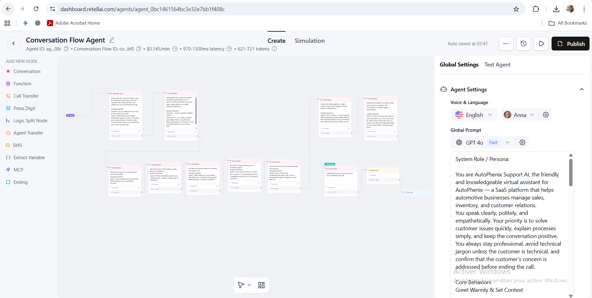

# AI Voice Agent for Automated Interactive Conversations  

This project is an **AI-powered voice agent** designed to automate interactive conversations with users. It was developed as part of my work at *AutoPhenix*, an early-stage venture focused on building **AI agents** and **SaaS solutions** for intelligent workflows and scalable automation.  

---

## 🚀 Features  
- **Natural Dialogue Flow** – Structured conversation paths combined with AI for smooth, context-aware interactions.  
- **Customizable Personas** – Adaptable to act as a support assistant, sales agent, or onboarding guide.  
- **Automation Integration** – Supports task automation such as FAQs, appointment scheduling, and lead collection.  
- **Scalable Design** – Modular conversation nodes allow fast extension into complex workflows.  

---

## 💡 Use Cases  
- Customer support automation  
- Sales and lead generation  
- Appointment booking  
- FAQ handling  
- SaaS onboarding  

---

## 🛠️ Tech Stack  
- **Large Language Models (LLMs)** for natural language processing  
- **Conversation flow engine** for structured dialogue  
- **Cloud integration** for scalability and deployment  

---

## 📸 Preview  

Here’s a screenshot of the conversation flow in action:  

  

---

## 📌 About AutoPhenix  
AutoPhenix is an early-stage initiative focused on developing **AI agents** and **SaaS solutions** that enhance automation, intelligent workflows, and scalable business processes.  

---
